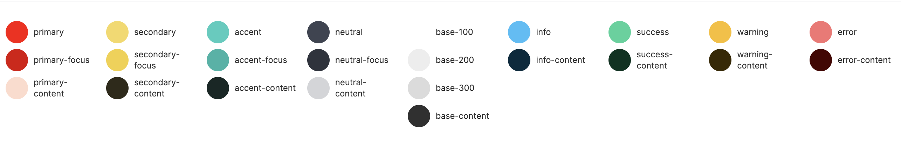

# daisyui-palette-demo

A very simple React component to demonstrate Daisy UI's color pallet. 

## What is this for?

The official documentation is great, but having a component in your project that shows you your chosen theme and any overrides you've applied. 




## Install

```bash
npm i daisyui-palette-demo
```

```react
import React from "react";
import PaletteDemo from "daisyui-palette-demo";

export default function Page() {
  return <PaletteDemo />;
}
```

## Demo with theme switcher
https://daisyuipalette.designgui.io
